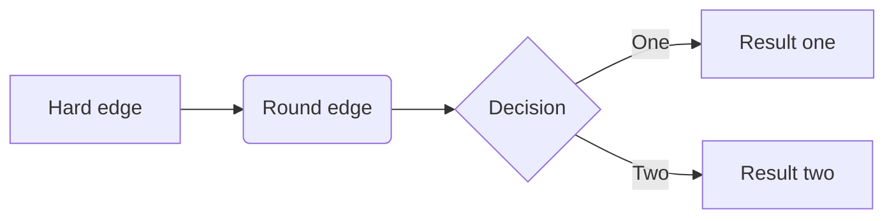
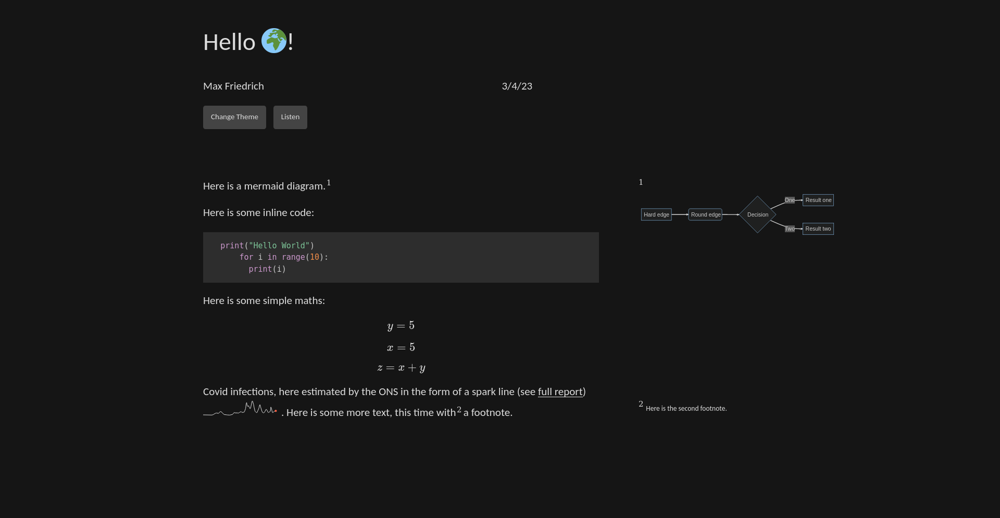

# README

## Introduction

This code contains functions that allow you to convert markdown files to
HTML, and optionally convert them to MP3 audio files using Google\'s
Text-to-Speech API. It also includes a function that evaluates and
replaces any python code blocks in the markdown files. It is heavily inspired by Edward Tufte's work and tufte-css. It is primarily designed for handouts and notes.

## Dependencies

The following python modules:

-   google-cloud-texttospeech
-   plotly

The following system packages:

- pandoc
- python
- nodejs
- [pandoc-sidenote](https://github.com/jez/pandoc-sidenote)

## How to Use

1.  Put all the markdown files you want to convert in the \"../md\"
    folder.
2.  Optionally, put any static files you want to include in the
    \"../static\" folder.
3.  Run the \"main()\" function to convert the markdown files to HTML
    and optionally to MP3 audio files. You can turn off the aud:w:io
    conversion by passing the \"-S\" or \"\--no-sound\" argument when
    running the script.
4.  The converted files will be saved in the \"../out\" folder.
5.  `cd` into the `out` folder and run `python -m http.server` to open a http server that you can use to view the output. Alternatively you can host it on an actual web server, to do that just copy the whole of the `out` folder to wherever you need for your web server.

## Example File

````markdown
---
title: Hello 🌍!
author: Max Friedrich
date: 3/4/23
---


Here is a mermaid diagram.[^1]

[^1]:


Here is some inline code:

```language-python
print("Hello World")
for i in range(10):
  print(i)
```
Here is some simple maths:

$$y=5$$
$$x = 5$$
$$z = x+y$$


```py
from graph import Chart
spark={"y":[0.17, 0.16, 0.11, 0.05, 0.02, 0.02, 0.04, 0.02, 0.01, 0.03, 0.03, 0.04, 0.03, 0.03, 0.03, 0.04, 0.04, 0.05, 0.09, 0.16, 0.18, 0.37, 0.57, 0.75, 0.98, 1.07, 1.14, 1.15, 1.10, 0.90, 0.83, 0.98, 1.12, 1.40, 1.96, 2.00, 1.80, 1.79, 1.48, 1.21, 0.83, 0.64, 0.41, 0.33, 0.26, 0.26, 0.24, 0.26, 0.18, 0.14, 0.08, 0.07, 0.06, 0.07, 0.07, 0.13, 0.15, 0.16, 0.19, 0.34, 0.54, 0.98, 1.26, 1.46, 1.23, 1.25, 1.19, 1.30, 1.31, 1.29, 1.19, 1.06, 1.13, 1.35, 1.54, 1.70, 1.91, 1.91, 1.61, 1.42, 1.49, 1.55, 1.54, 1.62, 2.10, 2.71, 3.58, 5.80, 6.65, 5.29, 4.66, 4.67, 5.03, 4.34, 3.70, 3.41, 3.65, 4.72, 6.21, 7.36, 7.40, 6.72, 5.72, 4.27, 2.78, 2.09, 1.80, 1.51, 1.35, 1.37, 1.96, 2.36, 3.20, 3.78, 5.05, 5.52, 4.60, 3.64, 2.46, 2.09, 1.54, 1.30, 1.21, 1.31, 1.47, 1.91, 2.62, 2.99, 3.07, 2.78, 2.31, 1.63, 1.39, 1.50, 1.60, 1.87, 2.08, 4.29, 3.84, 2.48, 1.52, 1.34, 1.47, 1.78, 2.07, 2.20, 2.27],"x":list(range(148))}
Chart(is_pdf).set_data(spark).spark(width=150).md("covid_infection.svg")
```
Covid infections, here estimated by the ONS in the form of a spark line (see [full report](https://www.ons.gov.uk/peoplepopulationandcommunity/healthandsocialcare/conditionsanddiseases/datasets/coronaviruscovid19infectionsurveydata)) . Here is some more text, this time with[^2] a footnote.

[^2]: Here is the second footnote.
````


