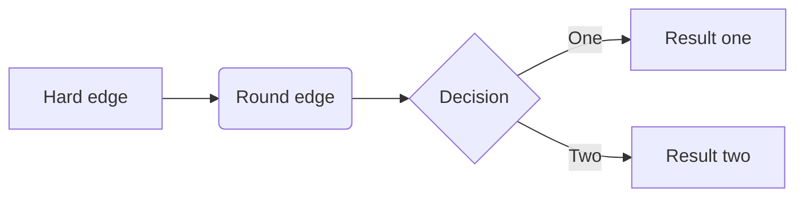

This is my first idea.

This is my **second** idea.


---

Here is a *new* and important idea than needed a horizontal rule.

> Sometimes it is the people no one can imagine anything of who do the things no one can imagine.

-*Alan Turing*

### Todo List

- [ ] Go shopping
- [x] Do the washing
- [ ] Make lunch
- [ ] Watch netflix
- [ ] waste time on [tiktok](https://tiktock.com)

### Priority list

1. Read a book
2. Write some code
3. Write boring text
4. Have fun

### The best programming language

```language-python
print("Hello World")
for i in range(10):
  print(i)
```

And here is some `inline` code.


<pre><code class="language-javascript">console.log("Hello, world!");</code></pre>

### html

<div style="color:red;">
hello world <b>some *text*</b>
</div>

### search engine

The best search engine is [google.com](google.com) [^1]

[^1]: As if! Try [duck.com](duck.com) for a much better experience. 🤦

### Table

| Syntax      | Description |
| ----------- | ----------- |
| Header      | Title       |
| Paragraph   | Text        |

### Definitions

First Term
: This is the definition of the first term.

Second Term
: This is one definition of the second term.
: This is another definition of the second term.

### Fancy text

~~The world is flat.~~ We now know that the world is round.

I need to highlight these ==very important words==.

H~2~O

X^2^

### Maths

$$y=5$$
$$x = 5$$
$$z = x+y$$

But this is great![^mathNote]

[^mathNote]: Lorem ipsum dolor sit amet, consectetur adipiscing elit. Donec scelerisque nisi libero, quis mollis leo fermentum venenatis. Donec luctus lectus quis lacus facilisis ullamcorper. Curabitur laoreet leo sodales justo dignissim, sit amet accumsan turpis feugiat. Donec varius iaculis nulla, at vulputate arcu hendrerit sed. Phasellus consequat lacinia orci at scelerisque. Phasellus bibendum justo nisi, ac congue lectus malesuada nec. Integer et nisi turpis. Lorem ipsum dolor sit amet, consectetur adipiscing elit. Cras et venenatis sem. Integer metus orci, euismod at laoreet eu, gravida eget nulla. Quisque vel metus at lacus bibendum posuere quis nec massa. 


### Sparklines [^4]

[^4]: This is another footnote.

### Charts

### Graph


Lorem ipsum dolor sit amet, consectetur adipiscing elit. Donec[^inText] scelerisque nisi libero, quis mollis leo fermentum venenatis. Donec luctus lectus quis lacus facilisis ullamcorper. Curabitur laoreet leo sodales justo dignissim, sit amet accumsan turpis feugiat. Donec varius iaculis nulla, at vulputate arcu hendrerit sed. Phasellus consequat lacinia orci at scelerisque. Phasellus bibendum justo nisi, ac congue lectus malesuada nec. Integer et nisi turpis. Lorem ipsum dolor sit amet, consectetur adipiscing elit. Cras et venenatis sem. Integer metus orci, euismod at laoreet eu, gravida eget nulla. Quisque vel metus at lacus bibendum posuere quis nec massa.

[^inText]: This is a breif footenote about this text.

Etiam in quam augue. In nisi massa, accumsan in neque vitae, tempus aliquet sapien. Sed quis bibendum mi. Fusce vitae eleifend dolor. Donec vehicula nisi sem, in efficitur metus imperdiet vel. Aliquam eleifend mi eget arcu blandit, ac luctus arcu volutpat. Nulla vestibulum convallis purus nec fermentum. Sed sed lacinia diam, vestibulum elementum magna. Quisque semper posuere ipsum ut interdum. Mauris porta nunc mauris, at dictum est suscipit non. Cras diam ligula, consequat vel scelerisque quis, sodales non urna. Pellentesque vitae eros pharetra, dignissim lacus non, finibus leo. Proin volutpat ornare tristique.

In sollicitudin tempus volutpat. Mauris quis velit eget odio laoreet faucibus. In bibendum quam mattis vestibulum ornare. In fringilla metus tortor, in elementum magna mattis vitae. Sed sit amet metus facilisis ante congue pretium eu quis urna. Duis in mi hendrerit, cursus orci in, faucibus ante. Donec eget ex laoreet, gravida mi ac, accumsan libero.

Ut nunc nulla, gravida id tellus quis, tristique tempor lectus. Vivamus quis nisl ipsum. Donec nulla neque, pellentesque tempor semper ac, accumsan in quam. In vel auctor massa. Praesent urna ligula, consectetur nec erat sit amet, semper vehicula mi. Mauris eget cursus lectus. Fusce id massa auctor, finibus libero eu, pellentesque elit. Nam vitae sapien pharetra, malesuada ex id, viverra urna. Morbi fringilla libero velit, non imperdiet justo tempor eu. Phasellus scelerisque faucibus hendrerit. Donec nec tellus cursus lectus porta mollis.

Integer nunc metus, dapibus vitae quam non, lacinia gravida magna. In ligula lorem, vehicula eu bibendum a, viverra aliquam odio. Aenean faucibus, mi id cursus porttitor, ex est feugiat est, ac volutpat diam lectus eu nisi. Aenean blandit leo est, sit amet cursus risus finibus eget. Mauris aliquet at est id porta. Aenean vestibulum nulla et sollicitudin sagittis. Fusce pretium, dolor sit amet maximus fringilla, diam ex posuere velit, porttitor consectetur felis lacus quis urna. Fusce molestie nunc in ornare pulvinar.

### Flowchart



