This is my first idea.

This is my **second** idea.


---

Here is a *new* and important idea than needed a horizontal rule.

> Sometimes it is the people no one can imagine anything of who do the things no one can imagine.

-*Alan Turing*

### Todo List

- [ ] Go shopping
- [x] Do the washing
- [ ] Make lunch
- [ ] Watch netflix
- [ ] waste time on [tiktok](https://tiktock.com)

### Priority list

1. Read a book
2. Write some code
3. Write boring text
4. Have fun

### The best programming language

```language-python
print("Hello World")
for i in range(10):
  print(i)
```

And here is some `inline` code.


<pre><code class="language-javascript">console.log("Hello, world!");</code></pre>

### html

<div style="color:red;">
hello world <b>some *text*</b>
</div>

### search engine

The best search engine is [google.com](google.com) [^1]

[^1]: As if! Try [duck.com](duck.com) for a much better experience. 🤦

### Table

| Syntax      | Description |
| ----------- | ----------- |
| Header      | Title       |
| Paragraph   | Text        |

### Definitions

First Term
: This is the definition of the first term.

Second Term
: This is one definition of the second term.
: This is another definition of the second term.

### Fancy text

~~The world is flat.~~ We now know that the world is round.

I need to highlight these ==very important words==.

H~2~O

X^2^

### Maths

$$y=5$$
$$x = 5$$
$$z = x+y$$

### Sparklines

```mermaid
gantt
    title Bar chart (days since last update)
    dateFormat  X
    axisFormat %s
    section 19062
    71   : 0, 71
    section 19061
    70   : 0, 70
    section 19401
    36   : 0, 36
    section 7089
    36   : 0, 36   
    section 193
    34   : 0, 34
    section 7441
    9   : 0, 9   
    section 1148
    8   : 0, 8
    section 1300
    5   : 0, 5
    section 1411
    2   : 0, 2   
    section 1701
    1   : 0, 1
```



### Charts

### Graph


### Flowchart


